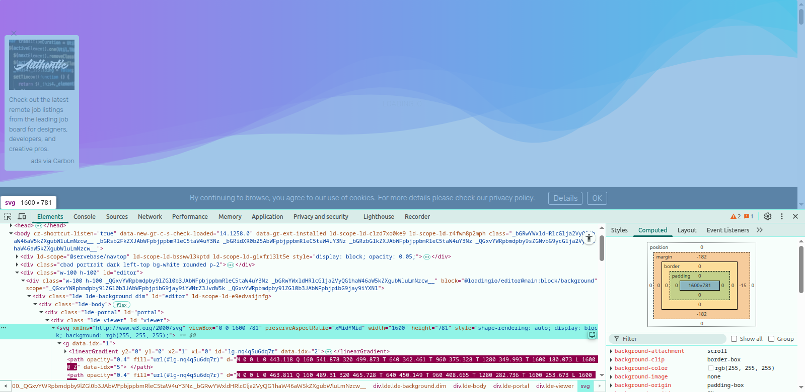

## Project Name:

## Project Description:  

## Features:

## Live Site Link:

## Project Video:

## What I Learned New while Building This Project:

1. How to implement theme using DaisyUI and toggle theme

```jsx
import React, { useEffect, useState } from 'react';
import { Link } from 'react-router';

const Navbar = () => {
    const [theme, setTheme] = useState("light")
    const handleToggle = (e) => {
        if (e.target.checked) {
            setTheme('synthwave')
        }
        else {
            setTheme('light')
        }
    }

    useEffect(() => {
        localStorage.setItem("theme", theme)
        const localTheme = localStorage.getItem("theme")
        document.querySelector('html').setAttribute('data-theme', localTheme)
    }, [theme])

    return (
        <div className="navbar bg-base-100 shadow-lg fixed z-100 ">
            <div className="flex-1">
                <Link
                    to='/'
                    className='btn btn-ghost gap-0 text-secondary normal-case text-2xl'
                >
                    Byte<span className='text-primary'>Blaze</span>
                </Link>
            </div>
            <div className="flex-none">
                <ul className="menu menu-horizontal px-1">
                    <li><a>Home</a></li>
                    <li><a>Blogs</a></li>
                    <li><a>Bookmarks</a></li>
                </ul>
                <label className="toggle text-base-content">
                    <input onChange={handleToggle} type="checkbox" className="theme-controller" />

                    <svg aria-label="sun" xmlns="http://www.w3.org/2000/svg" viewBox="0 0 24 24"><g strokeLinejoin="round" strokeLinecap="round" strokeWidth="2" fill="none" stroke="currentColor"><circle cx="12" cy="12" r="4"></circle><path d="M12 2v2"></path><path d="M12 20v2"></path><path d="m4.93 4.93 1.41 1.41"></path><path d="m17.66 17.66 1.41 1.41"></path><path d="M2 12h2"></path><path d="M20 12h2"></path><path d="m6.34 17.66-1.41 1.41"></path><path d="m19.07 4.93-1.41 1.41"></path></g></svg>

                    <svg aria-label="moon" xmlns="http://www.w3.org/2000/svg" viewBox="0 0 24 24"><g strokeLinejoin="round" strokeLinecap="round" strokeWidth="2" fill="none" stroke="currentColor"><path d="M12 3a6 6 0 0 0 9 9 9 9 0 1 1-9-9Z"></path></g></svg>

                </label>
            </div>
        </div>
    );
};

export default Navbar;
```

```jsx
@import "tailwindcss";

@plugin "daisyui" {
    themes: light --default, synthwave --prefersdark;
}
```

2. How to use animated background for free: 

- step 1: Go to the animated svg website and click the background
   
```
https://loading.io/background/m-wave/
``` 

- step 2: inspect the background and copy the svg form there: 



```
<svg xmlns="http://www.w3.org/2000/svg" viewBox="0 0 1600 781" preserveAspectRatio="xMidYMid" width="1600" height="781" style="shape-rendering: auto; display: block; background: rgb(255, 255, 255);"><g data-idx="1"><linearGradient y2="0" y1="0" x2="1" x1="0" id="lg-nq4q5u6dq7r" data-idx="2">
  <stop offset="0" stop-color="#ff00ff" data-idx="3"></stop>
  <stop offset="1" stop-color="#00ffff" data-idx="4"></stop>
</linearGradient><path opacity="0.4" fill="url(#lg-nq4q5u6dq7r)" d="M 0 0 L 0 443.431 Q 160 539.985 320 498.021 T 640 343.613 T 960 374.817 T 1280 348.139 T 1600 182.137 L 1600 0 Z" data-idx="5">
  
</path><path opacity="0.4" fill="url(#lg-nq4q5u6dq7r)" d="M 0 0 L 0 463.823 Q 160 491.45 320 468.026 T 640 448.465 T 960 409.64 T 1280 283.069 T 1600 246.382 L 1600 0 Z" data-idx="7">
  
</path><path opacity="0.4" fill="url(#lg-nq4q5u6dq7r)" d="M 0 0 L 0 544.988 Q 160 514.378 320 485.492 T 640 388.319 T 960 427.956 T 1280 292.822 T 1600 242.708 L 1600 0 Z" data-idx="9">
  
</path><path opacity="0.4" fill="url(#lg-nq4q5u6dq7r)" d="M 0 0 L 0 487.333 Q 160 473.961 320 439.382 T 640 378.379 T 960 413.628 T 1280 304.378 T 1600 306.702 L 1600 0 Z" data-idx="11">
  
</path><path opacity="0.4" fill="url(#lg-nq4q5u6dq7r)" d="M 0 0 L 0 546.515 Q 160 525.781 320 487.75 T 640 367.375 T 960 331.666 T 1280 325.731 T 1600 290.618 L 1600 0 Z" data-idx="13">
  
</path><g data-idx="15"></g></g><text data-watermark="true" text-anchor="middle" dominant-baseline="middle" stroke-opacity="0.1" fill="black" fill-opacity="0.1" stroke="white" stroke-width="1" font-size="15.0" x="800.0" y="390.5" data-idx="16" style="opacity: 1; font-size: 15px;">LOADING.IO</text></svg>
```

3. How to make a animated gradient text with tailwindcss

```jsx
<span
  className="text-2xl font-bold bg-gradient-to-r from-orange-700 via-blue-500 to-green-400 text-transparent bg-clip-text animate-gradient"
>
  My gradient text
</span>
```

```css
/* index.css */
.animate-gradient {
  background-size: 300%;
  -webkit-animation: animatedgradient 6s ease infinite alternate;
  -moz-animation: animatedgradient 6s ease infinite alternate;
  animation: animatedgradient 6s ease infinite alternate;
}

@keyframes animatedgradient {
  0% {
    background-position: 0% 50%;
  }
  50% {
    background-position: 100% 50%;
  }
  100% {
    background-position: 0% 50%;
  }
}
```

## Contact With Me: 

tamim.muhammad2005@gmail.com | +8801586090360 (WhatsApp)  

https://www.linkedin.com/in/tamim-muhammad
